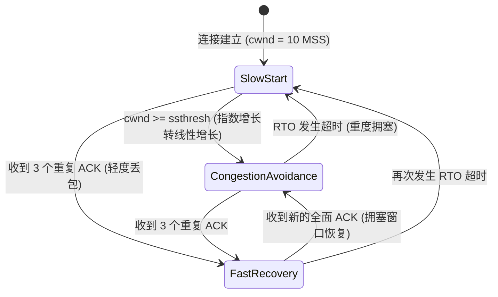
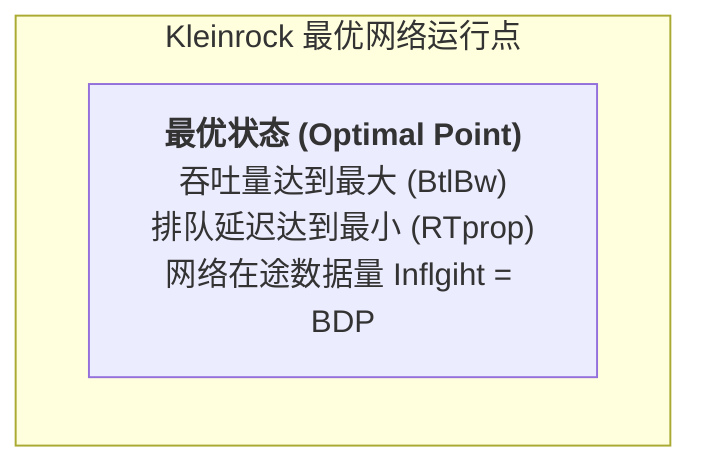
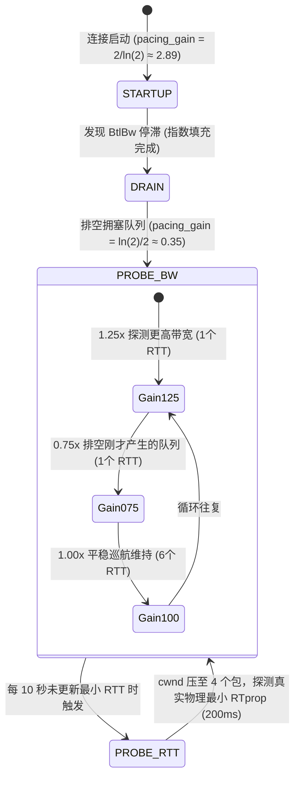
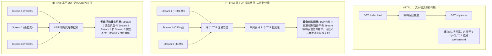

## 引言：流量控制与拥塞控制的本质分野

在专栏第二讲 [网络层与传输层精解：IP 路由选路、CIDR、TCP 三次握手/四次挥手状态机与滑动窗口第一性原理](/articles/network-layer-transport-layer-ip-routing-tcp-state-machine/) 中，我们剖析了 TCP 滑动窗口如何通过通告窗口（Advertised Window, `rwnd`）精确保护接收端的缓冲区内存。

然而，网络通信并非两点之间的理想直连管道，而是跨越成百上千台交换机与路由器的复杂网状拓扑：
- **流量控制（Flow Control）**：是**端到端（End-to-End）**的局部契约，解决的是“发送端发得太快，接收端应用程序读得太慢导致其内存溢出”的问题；
- **拥塞控制（Congestion Control）**：是**全局性（Global/Fabric-Wide）**的网络保护机制，解决的是“通信各方注入网络的数据总量超出了中间物理路由器队列容量与光纤物理带宽极限，导致路由器丢包与网络瘫痪”的问题。

1986 年，初生的互联网经历了人类历史上第一次灾难性的**“拥塞崩溃（Congestion Collapse）”**：全美主干网吞吐量在一瞬间从 32 Kbps 暴跌至 40 bps，下降了整整 800 倍！

为了拯救网络，Van Jacobson 于 1988 年提出经典的拥塞控制算法，奠定了现代互联网传输控制理论的基石。本文将带你全景拆解拥塞控制技术的三次范式跃迁：**基于丢包的经典算法（Reno/Cubic）$\to$ 基于带宽时延积模型的颠覆性革命（Google BBR）$\to$ 应用层协议栈大一统（HTTP/3 QUIC）**。

---

## 一、 基于丢包的拥塞控制：AIMD、Reno 与 Cubic 的数学演进

### 1.1 经典 AIMD 哲学与 TCP Reno 四大阶段

基于丢包的拥塞控制遵循核心原则：**网络是黑盒，丢包即拥塞**。发送端维护一个**拥塞窗口（Congestion Window, `cwnd`）**，实际能够发往网络的数据量受限于两者最小值：

$$W = \min(cwnd, rwnd)$$

TCP Reno 引入了著名的 **AIMD（加法递增，乘法递减）** 控制回路：



1. **慢启动（Slow Start）**：
   每经过一个往返时间（RTT），`cwnd` 翻倍（指数增长：$1, 2, 4, 8 \dots$），直到达到慢启动阈值 `ssthresh`；
2. **拥塞避免（Congestion Avoidance，加法递增）**：
   进入稳态后，每个 RTT 仅将 `cwnd` 增加 1 个 MSS（线性增长），谨慎探测网络剩余带宽；
3. **快重传与快恢复（Fast Retransmit & Fast Recovery，乘法递减）**：
   当收到 3 个重复 ACK（Duplicate ACK）时，判定单包丢失而非全网断裂，立即重传该包，将 `ssthresh` 砍半（$\text{ssthresh} = \frac{cwnd}{2}$），并将 `cwnd` 设置为 `ssthresh + 3` 进入快恢复，避免退化回慢启动。

#### 致命缺陷：Bufferbloat（缓冲区膨胀）
以 Reno 为代表的算法基于“丢包才算拥塞”的假设，导致发送端不断狂塞数据，**硬生生将中间路由器的硬件深缓冲区塞满**。虽然没有丢包，但数据包在路由器队列中排队等待长达数百毫秒甚至数秒，导致**极高的 RTT 膨胀和剧烈的排队延迟（Queueing Delay）**，严重摧毁实时交互体验！

### 1.2 TCP Cubic：三次方程拟合与 RTT 不相关性

在跨国高带宽长延迟（High-BDP）网络中，Reno 每次线性只加 1 MSS 的策略极其缓慢，填满 10Gbps 光纤甚至需要几个小时。

Linux 内核在 2.6.19 引入了 **TCP Cubic** 并将其设为长期默认算法。Cubic 将拥塞窗口增长函数设计为一个以时间 $t$ 为自变量的**三次多项式方程**：

$$W_{cubic}(t) = C \cdot (t - K)^3 + W_{max}$$

其中：
- $W_{max}$ 为上一次发生拥塞丢包时的窗口大小；
- $K = \sqrt[3]{\frac{W_{max} \cdot \beta}{C}}$，为窗口恢复到 $W_{max}$ 所需的时间常数；
- $C$ 为算法调优常数（默认约 0.4），$\beta$ 为乘法递减因子（默认约 0.2）。

```
Cubic 窗口增长曲线 (凹凸两阶段):
      cwnd ^                                    / (凸阶阶段: 快速试探新带宽)
           |                                  /
           |                                /
   W_max --+---------------------+        /
           |   (凹阶段: 快速回归)  \    /
           |                     \  /
           |                      \/
           +---------------------------------------------> 时间 t
                                  t = K
```

- **凹阶段（Concave Phase）**：丢包后窗口迅速爬升，越靠近 $W_{max}$ 增速越缓，以高度平滑的姿态逼近原有容量；
- **高原阶段（Plateau）**：在 $t \approx K$ 附近保持相对平稳，最大化网络利用率并维持稳定性；
- **凸阶段（Convex Phase）**：若长时间无丢包，窗口加速上扬，积极探索物理链路是否存在更高的新带宽！
- **数学优势**：Cubic 的增长**完全由独立物理时间 $t$ 决定，与链路的 RTT 完全解耦**，彻底解决了 Reno 算法在长 RTT 链路下被短 RTT 链路恶性挤占带宽的不公平问题。

---

## 二、 基于模型的拥塞控制革命：Google BBR 物理建模

无论 Reno 还是 Cubic，本质上都是**丢包驱动（Loss-based）**的算法。丢包往往滞后于拥塞，且在弱网无线信道中，随机电磁干扰引起的误码丢包并不等于拥塞。

2016 年，Google 提出了基于**瓶颈带宽与往返时延（Bottleneck Bandwidth and RTT, BBR）**的全新模型驱动算法。

### 2.1 Kleinrock 理想工作点与带宽时延积（BDP）



根据控制理论，物理网络的容量由两个物理常数决定：
1. **$BtlBw$（Bottleneck Bandwidth，瓶颈链路物理带宽）**：由路径上最慢的网卡/光纤物理吞吐量决定；
2. **$RTprop$（Round-Trip Propagation Time，往返物理传播时延）**：由光信号在玻璃光纤中的光速及物理距离决定。

由此定义网络的最优在途容量 —— **带宽时延积（Bandwidth-Delay Product, BDP）**：

$$BDP = BtlBw \times RTprop$$

- **状态 1（欠载区，$\text{Inflight} < BDP$）**：管道没填满，网络带宽未充分利用；
- **状态 2（最优平衡点，$\text{Inflight} = BDP$）**：**吞吐量达到理论峰值，中间路由器完全没有积压排队，网络延迟维持物理光速极限！**
- **状态 3（缓冲排队区，$\text{Inflight} > BDP$）**：管道已满，多发的数据全部在路由器队列堆积，引发 Bufferbloat 和延迟飙升；
- **状态 4（丢包崩溃区）**：路由器队列溢出，发生严重丢包。

**BBR 的颠覆性核心思想**：坚决不让网络滑入状态 3 和状态 4，通过交替测量 $BtlBw$ 与 $RTprop$，精准将网络流量锁定在 **Kleinrock 最优工作点（$\text{Inflight} = BDP$）**！

### 2.2 BBR 状态机与起搏速率控制（Pacing Rate）

BBR 不再单纯依赖 TCP 窗口滑动，而是引入了精准的**起搏速率引擎（Pacing Rate）**，以恒定的纳秒级时间间隔均匀向网卡喷射数据包：

```
pacing_rate = pacing_gain * BtlBw
```



1. **STARTUP 阶段**：以 $2.89\times$ 的高增益迅速探明瓶颈带宽；
2. **DRAIN 阶段**：以 $0.35\times$ 的低增益主动压低发送速率，清空 STARTUP 阶段在路由器中造成的排队堆积；
3. **PROBE_BW 阶段（巡航稳态）**：采用 8 周期循环（$1.25 \to 0.75 \to 1.0 \times 6$）。先加速探顶，再降速排空队列，其余时间平稳运行；
4. **PROBE_RTT 阶段**：每 10 秒强制将 `cwnd` 限制为 4 个数据包并维持 200ms，迫使网络队列彻底归零，从而准确测量出物理光缆的无干扰真实时延 $RTprop$。

---

## 三、 应用层与传输层协议大一统：HTTP/1.1、HTTP/2 到 HTTP/3 (QUIC)

即使拥塞控制算法做到了极致，**TCP 协议本身的内核实现与单流特性**依然成为了应用层吞吐与延迟的最大绊脚石。

### 3.1 协议栈演进与线头阻塞（Head-of-Line Blocking）之战



### 3.2 HTTP/3 (QUIC) 的五大颠覆性特性

1. **彻底消除跨流线头阻塞**：
   QUIC 在 UDP 基础之上，为每一个逻辑 Stream 维护独立的序列号与滑动窗口。即使 Stream A 丢包重传，Stream B 和 Stream C 照常解码交付；
2. **0-RTT 极速握手建连**：
   将传统 TCP 3 次握手（1-RTT）与 TLS 1.3 握手（1-RTT）合并为一次交互。客户端二次访问时，可在第一声 `Client Hello` 中直接附带应用层加密数据，实现真正的 **0-RTT** 极速响应；
3. **连接迁移（Connection Migration）**：
   传统 TCP 依据四元组（源IP, 源端口, 目的IP, 目的端口）绑定套接字。手机用户从 Wi-Fi 走到室外切换到 5G 基站时，源 IP 发生变化，TCP 连接必然断开重连。
   QUIC 采用 64 位的 **Connection ID（CID）** 标识通信双方，即使底层网络 IP/端口剧烈变动，上层长连接丝滑漫游，用户正在进行的视频通话或直播毫秒级无感继续！
4. **用户态拥塞控制与可热插拔演进**：
   TCP 算法深嵌于 Linux 内核，算法迭代或补丁更新需要耗费数月甚至数年升级宿主机内核；QUIC 算法完全运行在用户态，应用层随时可通过编译新二进制热更新最前沿的拥塞控制逻辑；
5. **端到端加密与防篡改**：
   QUIC 除了首部的少数标志位外，几乎所有元数据（包括 Packet Number、Stream Offset、甚至 ACK 确认帧）均在 TLS 1.3 保护下全面加密，彻底消除了中间运营商（ISP）的中间人透明代理与篡改。

---

## 四、 生产级环境调优实战

### 4.1 Linux 服务器开启 Google BBR 与 FQ 调度器

在现代 Linux 内核（Linux 4.9+ 原生支持，推荐 Linux 5.15+ 或 6.x）中全面启用 BBR：

```bash
# 1. 检查当前内核拥塞控制算法
sysctl net.ipv4.tcp_congestion_control
sysctl net.ipv4.tcp_available_congestion_control

# 2. 写入生产优化配置
cat << 'EOF' >> /etc/sysctl.conf
# BBR 起搏机制强制依赖 Fair Queueing (FQ) 队列调度器
net.core.default_qdisc = fq
# 切换拥塞控制为 bbr
net.ipv4.tcp_congestion_control = bbr
EOF

# 3. 立即加载生效
sysctl -p

# 4. 验证 BBR 是否正确激活
lsmod | grep bbr
```

---

## 五、 总结与进阶预告

从以太网数据链路、IP LPM 路由选路，到 TCP 状态机、滑动窗口、Cubic 与 BBR 拥塞控制，再到基于 UDP 的 HTTP/3 QUIC 传输革命，我们完整绘制了传统互联网跨主机通信的宏伟图卷。

然而，当人类科技文明在 2026 年大步迈入 **AI 大模型、万卡 GPU 并行训练与 PB 级大规模分布式存储时代** 时，网络世界的游戏规则发生了天翻地覆的剧变：
- 传统的以太网基于生成树协议（STP）与层级汇聚，东西向流量（East-West Traffic）带宽瞬间被汇聚层掐死；
- 数据中心机房如何通过 **Clos 架构与 2-Tier / 3-Tier Leaf-Spine** 拓扑，实现任意服务器之间的全无阻塞（Non-blocking）高吞吐传输？
- 在云原生多租户大二层网络中，**BGP Underlay、VXLAN 报文封装与 EVPN 控制平面** 究竟是如何协作编排网络虚拟化的？

在接下来的**专栏第四讲**中，我们将踏入数据中心物理机房的机柜深处 —— **[现代数据中心网络架构第一性原理：Clos 拓扑、Leaf-Spine 组网、BGP Underlay 与 EVPN-VXLAN 大二层虚拟化](/articles/datacenter-network-clos-leaf-spine-bgp-evpn-vxlan/)**！

---

## 常见问题 (FAQ)

### Q1: 为什么启用 Google BBR 时，必须将队列调度器设置为 `fq`（Fair Queueing）而不是默认的 `pfifo_fast`？
**根本原因：BBR 的核心依赖于高精度的“流量起搏（Pacing）”，而 `pfifo_fast` 完全不具备纳秒级发包延迟控制能力。**
传统 Linux 协议栈在应用层写入数据时，会直接一口气向网卡驱动推送突发数据包（Burst），由网卡或队列一次性喷出。BBR 的核心是消除突发队列，它计算出的 `pacing_rate` 要求内核以极度均匀的纳秒级时间间隔依次发送单个数据包。
`fq`（Fair Queueing）调度器内置了专用硬件/软件定时器，能够为每一个 TCP 连接维护独立的流起搏时间戳，精准在指定时刻释放数据包。如果使用传统的 `pfifo_fast` 或普通 FIFO 队列，发送端依然会突发倾泻数据，导致中间交换机瞬间打爆队列丢包，使得 BBR 的带宽时延积测量严重失真。

### Q2: 在卫星通信、弱网 Wi-Fi 等高随机丢包环境（例如 10% 随机丢包）中，为什么 Cubic 吞吐暴跌几乎归零，而 BBR 仍能跑满全速？
**根本原因在于拥塞信号判定维度的物理本质差异：**
- **Cubic 基于丢包驱动**：它坚信“丢包 = 网络发生了严重拥塞”。只要遭遇 10% 的丢包，Cubic 就会不断触发快重传与乘法递减，将拥塞窗口 `cwnd` 呈指数级持续砍半，最终窗口退化至 1 个 MSS 左右，吞吐量呈现断崖式暴跌；
- **BBR 基于模型驱动**：它通过实时的交付速率（Delivery Rate）与极小 RTT 联合建模。BBR 认为：即使丢包率高达 10%，只要收到 ACK 的频率依然符合瓶颈物理带宽 $BtlBw$，网络物理管道就绝对没有堵塞！BBR 会持续稳定维持其高发包速率，仅重传丢失的报文，从而稳健跑满 90% 以上的物理信道极限吞吐。

### Q3: 既然 HTTP/3 (QUIC) 跑在不可靠的 UDP 之上，为什么在真实公网中不仅不丢包，还能做到比 TCP 更安全可靠？
**根本原因：QUIC 仅仅是将传统由内核实现的“可靠传输协议栈”全部搬到了用户态应用程序中，并由 TLS 1.3 提供底层防御。**
1. **可靠性全量兜底**：QUIC 协议栈自身实现了单调递增的 Packet Number、严格的 ACK 机制、SACK 选择性确认、用户态 Cubic/BBR 拥塞控制与超时重传。UDP 只是被 QUIC 用作穿透公网物理交换机与 NAT 网关的最底层无状态容器（Container）；
2. **杜绝协议僵化与更高安全性**：传统公网上的各种老旧防火墙、中间安全盒子（Middleboxes）会恶意拦截、修改甚至重置未知的 TCP 选项。而 QUIC 的数据除极简的 UDP 首部外，所有控制帧、流标识、确认序号均经过 TLS 1.3 端到端高强度加密，网络中间设备根本无法识别更无法篡改其内部逻辑，从而在不可靠且充满恶意的公网中实现了极致安全与绝对可靠。
