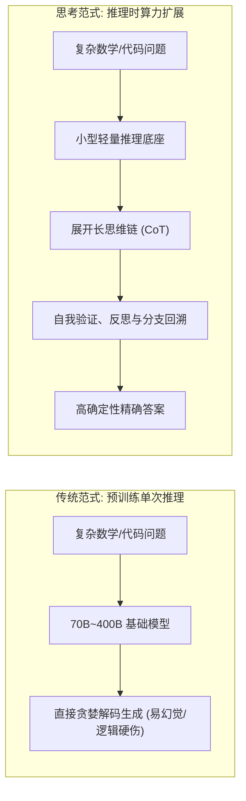
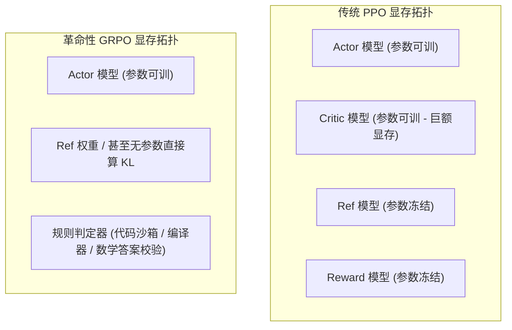

## 引言：Scaling Law 撞墙与推理时扩展的诞生

在过去的几年里，大模型界奉为圭臬的法则是 **Chinchilla 预训练缩放定律（Pre-training Scaling Laws）**：堆叠更多的参数、灌入更多的清洗语料、燃烧更多的 GPU FLOPs。

然而步入 2026 年，这一范式在物理和工程上面临双重撞墙：
1. **人类高质量文本语料耗尽**：公开互联网中高信噪比的文本数据已经被各大厂商的爬虫清洗殆尽，合成数据在自回归预训练中的“模型崩溃（Model Collapse）”与信息熵衰减日益显现；
2. **训练算力边际收益剧降**：将参数量从 70B 推向 700B，硬件成本和分布式通信开销呈指数级暴涨，但常识问答和基础语义理解的提升却极为微弱。

当“预训练算力扩展”收益递减时，以 OpenAI o1/o3 和 DeepSeek-R1 为代表的**思考模型（Reasoning Models）**点燃了第二曲线：**推理时算力扩展定律（Test-Time Scaling Laws）**。



本文将从第一性原理出发，推导**推理时算力的三种主流扩展范式**，深度剖析让长思考链自发涌现的革命性算法 —— **GRPO（Group Relative Policy Optimization，组相对策略优化）**，并给出可直接运行的动手实战代码。

---

## 一、推理时算力扩展 (Test-Time Compute) 的三大范式

什么是推理时计算？简单来说，**与其在预训练时花数亿美元教会模型所有题目的最终答案，不如教模型在遇到难题时，通过消耗额外的推理 Token 进行思考、演算与自我验证**。

在学术界与工业界，扩展推理时计算主要分为以下三种机制：

| 推理扩展范式 | 核心运作机制 | 算力消耗节点 | 典型算法与代表 | 局限性与瓶颈 |
|:---|:---|:---|:---|:---|
| **1. 单轨迹自回归扩展 (Sequential CoT)** | 引导模型自主输出上千乃至数万 Token 的思维链（`<think> ... </think>`），允许回溯与草稿推演。 | 自回归生成解码阶段 | DeepSeek-R1, OpenAI o1 | 容易出现死循环“过度思考（Overthinking）”，低难度题目延迟翻倍。 |
| **2. 叶节点并行采样与聚合 (Leaf-level Sampling)** | 对同一个 Prompt 并行采样 $N$ 条候选路径，通过多数投票（Majority Voting）或轻量判别器聚合最佳解。 | 并发请求扩展 | Best-of-N, Self-Consistency | 搜索空间离散，错误推理路径被全量计算，算力浪费严重。 |
| **3. 前缀树状态搜索 (Prefix-level Search)** | 引入过程奖励模型（PRM，Process Reward Model），在 Token 或步骤节点上运行束搜索（Beam Search）或 MCTS。 | 树搜索扩展与步骤评分 | AlphaGo 式 MCTS, Step-level PRM | PRM 标注极度昂贵，步骤价值估计不准时易诱发“欺骗奖励（Reward Hacking）”。 |

DeepSeek-R1 的核心突破，正是将 **单轨迹自回归扩展** 与 **强化学习策略优化** 完美融合，证明了纯规则驱动的强化学习无需人工昂贵编写步骤级 PRM，就能自发引导模型学会深度思考。

---

## 二、从 PPO 到 GRPO：为什么传统 RLHF 在长思维链中濒临崩溃？

在过去很长一段时间里，大模型后训练阶段的标准强化学习算法是 **PPO（Proximal Policy Optimization，近端策略优化）**。然而在训练推理模型时，PPO 的系统开销和收敛难度让几乎所有工程团队头疼不已。

### 1. PPO 的四大模型显存恶魔
一个典型的 PPO 训练系统必须在显存中常驻或频繁交互 **4 个模型**：
* **Actor Model（策略模型 $\pi_\theta$）**：正在被训练的主模型，负责生成 Token。
* **Critic Model（价值模型 $V_\phi$）**：通常与 Actor 具有相同参数规模，用于估计每个状态的价值基线 $V(s)$。
* **Reference Model（参考模型 $\pi_{ref}$）**：通常为冻结的初始模型，用于计算 KL 散度惩罚，防止策略跑飞。
* **Reward Model（奖励模型 $R_\psi$）**：用于对最终生成的文本进行打分。



在 70B 模型训练中，仅仅 Actor + Critic 的模型参数、梯度和 AdamW 优化器状态，就需要消耗超过 **600GB 显存**，训练集群必须配置复杂的数据并行与流水线并行。关于多卡互联与驱动显存通信优化，可参考 [NVIDIA GPU 驱动栈与显存架构解析](/articles/nvidia-gpu-package-architecture/)。

### 2. 价值估计漂移与长思维链的灾难
在复杂数学定理证明或万行代码生成中，思维链长度往往超过 8,000 到 16,000 Token。Critic 价值模型需要在如此漫长的前向过程中，准确估计每一个中间 Token 的全局期望回报，这在数学上极度困难。Critic 的频繁误判会导致梯度方差巨大，引发训练崩溃（Loss 发散至 NaN）。

---

## 三、GRPO 底层数学推导：彻底拿掉 Critic 的优雅设计

**GRPO（Group Relative Policy Optimization，组相对策略优化）** 最早由 DeepSeek 团队在 DeepSeekMath 论文中提出，并在 DeepSeek-R1 中大放异彩。

它的核心思想惊人地纯粹：**完全剔除独立的 Critic 价值模型，通过对同一个 Prompt 进行组采样，利用组内的平均表现作为动态基线！**

### 1. 组采样与相对优势函数（Advantage）
对于每一个输入的 Prompt $q$，Actor 策略模型 $\pi_\theta$ 不再只采样一个回答，而是并行采样一组包含 $G$ 个候选回答的集合：

$$\{o_1, o_2, \dots, o_G\} \sim \pi_{\theta_{old}}(q)$$

环境（如数学答案匹配器、单元测试编译器等）对这 $G$ 个回答分别计算真实奖励值：

$$\{r_1, r_2, \dots, r_G\}$$

为了在没有 Critic 模型的情况下评估某个回答 $o_i$ 到底算好还是算差，GRPO 直接利用这组采样的统计均值和标准差来计算相对优势（Normalized Advantage）$A_i$：

$$A_i = \frac{r_i - \text{mean}(\{r_1, \dots, r_G\})}{\text{std}(\{r_1, \dots, r_G\}) + \epsilon}$$

* 如果回答 $o_i$ 的得分高于该组平均水平，$A_i > 0$，模型强化对应 Token 序列的生成概率；
* 如果低于组均值，$A_i < 0$，概率受到抑制；
* 分母除以标准差，天然起到了自适应归一化缩放（Batch Normalization）的作用。

### 2. 目标优化函数与裁剪机制
GRPO 继承了 PPO 的重要性采样裁剪（Clipped Surrogate Objective）思想，其最大化目标函数定义为：

$$\mathcal{J}_{GRPO}(\theta) = \mathbb{E}_{q \sim P(Q), \{o_i\}_{i=1}^G \sim \pi_{\theta_{old}}(q)} \left[ \frac{1}{G} \sum_{i=1}^{G} \frac{1}{|o_i|} \sum_{t=1}^{|o_i|} \left( \min \left( \frac{\pi_\theta(o_{i,t} \mid q, o_{i,<t})}{\pi_{\theta_{old}}(o_{i,t} \mid q, o_{i,<t})} A_{i,t}, \; \text{clip}\left(\frac{\pi_\theta(o_{i,t} \mid q, o_{i,<t})}{\pi_{\theta_{old}}(o_{i,t} \mid q, o_{i,<t})}, 1-\epsilon, 1+\epsilon\right) A_{i,t} \right) - \beta D_{KL}(\pi_\theta \parallel \pi_{ref}) \right) \right]$$

其中：
* $A_{i,t} = A_i$：整个序列的组相对优势直接广播给每个 Token（在更精细的实现中可结合 Token 级掩码）；
* $\text{clip}(r_t, 1-\epsilon, 1+\epsilon)$：防止新旧策略参数更新步长过大导致分布坍塌；
* $D_{KL}(\pi_\theta \parallel \pi_{ref})$：施加在每个 Token 上的无偏 KL 散度近似，其解析式为：
  $$D_{KL} = \frac{\pi_{ref}(o_{i,t} \mid \cdot)}{\pi_\theta(o_{i,t} \mid \cdot)} - \log \frac{\pi_{ref}(o_{i,t} \mid \cdot)}{\pi_\theta(o_{i,t} \mid \cdot)} - 1$$

通过这一改造：
1. **显存消耗削减 50% 以上**：省去了庞大的 Critic 价值网络及其所有优化器状态；
2. **消除了价值模型拟合偏差**：优势函数完全源自真实的组内对比统计，收敛稳健性大幅飙升。

---

## 四、思维链的“顿悟时刻 (Aha Moment)”与自发涌现

在 DeepSeek-R1-Zero 的实验中，研究人员展示了一个震撼学术界的现象：**在零人工标注数据（Zero SFT Examples）的前提下，仅使用纯基础模型（Base Model）搭配 GRPO 强化学习，模型自发演化出了长思维链！**

### 1. 规则奖励函数设计
在 R1-Zero 中，完全没有使用传统的拟合神经网络 Reward Model，而是完全采用高确定性的规则代码判定器：
1. **准确性奖励（Accuracy Reward）**：对于数学题，提取答案标签并判断是否与正确答案完全一致（一致给 1 分，错误给 0 分）；对于代码题，直接在沙箱执行 LeetCode 单元测试。
2. **格式一致性奖励（Format Reward）**：强制要求模型输出必须将思考过程包含在 `<think>` 与 `</think>` 标签之间，最终结论包含在 `<answer>` 标签内。

### 2. 自我反省的自发涌现
在经过数千步强化学习迭代后，随着生成长度自动拉长，模型的日志中开始频繁出现以下人类未曾显式教给它的自省模式：

```text
User: Is 9.11 larger than 9.9?
Assistant:
<think>
First, compare 9.11 and 9.9.
The integer part is both 9.
Now compare the tenths place: 9.11 has 1 in the tenths place, while 9.9 has 9 in the tenths place.
Wait! Let me rethink this... Am I confusing decimal places with versions?
In software, 9.11 might be newer than 9.9, but mathematically, 9.9 = 9.90.
Since 9.90 > 9.11, 9.9 is strictly larger.
Let me double check the calculation: 9.9 - 9.11 = 0.79 > 0. Yes, absolutely correct.
</think>
<answer>
No, 9.9 is larger than 9.11.
</answer>
```

这一现象从系统物理学角度解释了**探索（Exploration）**的威力：为了在具有难度的复杂逻辑题中拿到底层的 $r=1$ 奖励，策略梯度强制要求模型在内部隐式尝试多种分支路径。凡是具备“自我质疑与回溯验证”的轨迹，其通过率显著高于鲁莽猜测的轨迹，因而在组相对优势归一化中获得了持续的正向反馈增强。

---

## 五、动手实战：构建最小可运行的 GRPO 训练流水线

下面我们使用基于 HuggingFace **TRL (Transformer Reinforcement Learning)** 的开源框架，展示如何针对一个轻量级基础模型（如 Qwen2.5-1.5B-Base）启动极简的 GRPO 训练。

### 1. 安装核心依赖
```bash
pip install torch transformers trl peft datasets accelerate
```

### 2. 完整训练脚本实现

```python
import re
import torch
from datasets import Dataset
from transformers import AutoTokenizer, AutoModelForCausalLM
from trl import GRPOTrainer, GRPOConfig

# 1. 准备高确定性验证数据集 (以算术谜题为例)
train_data = [
    {
        "prompt": "Solve this equation: 3 * x + 7 = 22. What is x? Present your reasoning inside <think> and final value in <answer>.",
        "target": "5"
    },
    {
        "prompt": "A train travels 180 km in 3 hours. What is its speed in km/h? Think first in <think>, give value in <answer>.",
        "target": "60"
    },
    {
        "prompt": "If a square has an area of 64 cm^2, what is its perimeter in cm? Reason in <think>, answer in <answer>.",
        "target": "32"
    }
] * 100 # 扩充训练集规模

dataset = Dataset.from_list(train_data)

# 2. 定义纯规则驱动的奖励函数 (Reward Functions)
def correctness_reward_func(prompts, completions, target, **kwargs):
    """验证 <answer> 标签内的数值是否 100% 匹配标准答案"""
    rewards = []
    for completion, true_target in zip(completions, target):
        match = re.search(r"<answer>(.*?)</answer>", completion, re.DOTALL)
        if match:
            pred = match.group(1).strip()
            # 严格匹配正确得 2.0 分，否则 0.0 分
            rewards.append(2.0 if pred == true_target.strip() else 0.0)
        else:
            rewards.append(0.0)
    return rewards

def format_reward_func(completions, **kwargs):
    """校验思维链标签与格式闭合规范性"""
    rewards = []
    pattern = r"^<think>.*?</think>\s*<answer>.*?</answer>$"
    for completion in completions:
        # 符合闭合标准给 0.5 分奖励
        if re.search(pattern, completion.strip(), re.DOTALL):
            rewards.append(0.5)
        else:
            rewards.append(0.0)
    return rewards

# 3. 初始化模型与分词器
model_id = "Qwen/Qwen2.5-1.5B-Instruct"
tokenizer = AutoTokenizer.from_pretrained(model_id)
if tokenizer.pad_token is None:
    tokenizer.pad_token = tokenizer.eos_token

# 4. 配置 GRPO 超参数
training_args = GRPOConfig(
    output_dir="./grpo_output_qwen",
    learning_rate=2e-5,
    per_device_train_batch_size=2,
    gradient_accumulation_steps=4,
    num_generations=4,         # 组采样大小 (Group Size G=4)
    max_prompt_length=256,
    max_completion_length=1024, # 预留充足的思维链推导空间
    temperature=0.7,
    warmup_ratio=0.1,
    logging_steps=10,
    max_steps=100,
    save_strategy="steps",
    save_steps=50,
    bf16=True,
    report_to="none"
)

# 5. 启动 GRPO 训练循环
trainer = GRPOTrainer(
    model=model_id,
    reward_funcs=[correctness_reward_func, format_reward_func],
    args=training_args,
    train_dataset=dataset,
)

print("🚀 正在启动无 Critic 的 GRPO 强化学习训练流水线...")
trainer.train()
```

*通过上述代码，每次迭代针对每个问题采样 4 个不同的思维路径，通过 `correctness_reward_func` 与 `format_reward_func` 实施组内相对打分，驱动模型自主学会长逻辑思辨。关于微调基础原理及显存控制，可参阅我们的 [大模型微调全流程指南](/articles/fine-tuning-guide/)。*

---

## 六、生产落地警示：Overthinking 陷阱与动态预算治理

在实际业务中盲目采用思考模型，容易掉入以下致命陷阱：

1. **过度思考（Overthinking）惩罚**：在处理“中国的首都是哪里？”这类常识性检索时，模型可能依然会强制输出 800 字的 `<think>` 自我怀疑与反问，导致吞吐暴跌、首字延迟（TTFT）激增数秒；
2. **推理预算动态分配（Dynamic Budget Allocation）**：高阶工程落地的最优实践是采用**两阶段路由中枢**：
   * 80% 的日常检索和格式化问答，直接路由给常规轻量级模型或走 [RAG 检索增强架构](/articles/rag-in-practice/)；
   * 20% 涉及代码生成、复杂数理与多步规划的高难逻辑，才转交至开启了 GRPO 思考链的端点，并设置自适应思考上限（`max_thinking_tokens`）。关于推理集群的高并发吞吐配置，请参阅 [vLLM 生产级部署全指南](/articles/vllm-serving-guide/)。

---

## 常见问题 (FAQ)

### Q1: 为什么 GRPO 在没有 Critic 模型的情况下依然能够收敛？
GRPO 利用蒙特卡洛组采样替代了传统贝尔曼方程的状态价值估计。在同一 Prompt 条件下，对生成的 $G$ 个样本直接计算均值作为基线。只要采样组容量 $G$ 足够（通常 $G \ge 4 \sim 8$），组内样本差异即反映了当前策略的局部方差，由此计算出的优势函数 $\frac{r_i - \mu}{\sigma}$ 具备渐进无偏性，彻底免除了对价值神经网络的梯度拟合。

### Q2: GRPO 是否完全不需要高质量的 SFT（监督微调）冷启动数据？
尽管像 DeepSeek-R1-Zero 证明了纯 RL 也能涌现思维链，但在工业界落地中，**混合冷启动 SFT** 是性价比最高的方案。若直接在 Base 模型上运行纯 RL，前期会产生大量不可读的乱码、语种混杂以及无限死循环。先通过几千条高质量的 CoT 模板做轻量对齐（冷启动 SFT），再接入 GRPO 强化学习，可以加速收敛达 5 倍以上，并保证可读性。

### Q3: GRPO 与 DPO（直接偏好优化）有什么核心区别？
DPO 属于**离线监督式偏好学习**（Offline），依赖预先收集固定的正负样本对 $(y_w, y_l)$，模型无法在探索过程中发现超出静态数据集以外的全新推理路径；而 GRPO 属于**在线强化学习**（Online Exploration），每一轮更新都由模型实时生成候选采样并由规则环境即时打分，因而能够探索并演化出自发反思与自我纠错的新策略。
