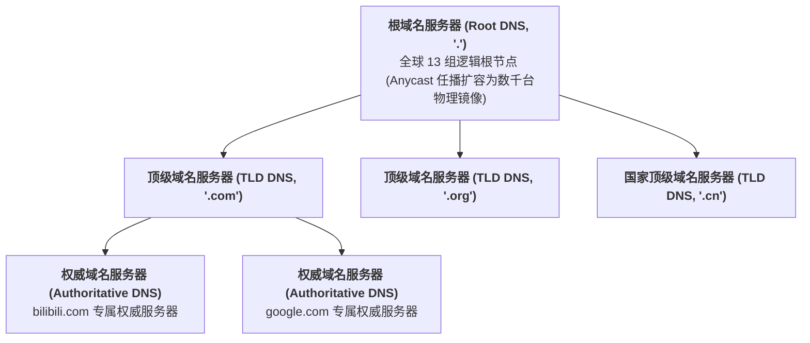
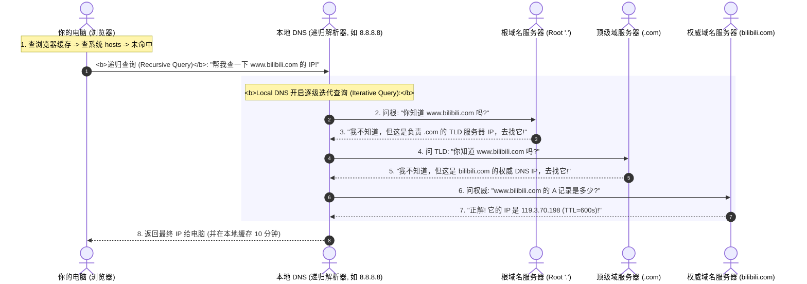

## 引言：从人类语言到机器进程的“最后几公里”

在前三讲中，我们完成了计算机网络从底层铜线光纤、MAC 帧交换到三层 IP 子网与 VLAN/NAT 企业基建的完整探索。

此时，你的电脑已经具备了与全球任何一台服务器通信的能力。然而，真实世界中的网络交互远不止于“两台物理机器互发报文”这么简单：
- **人类记不住冰冷的数字**：没有人会在浏览器里输入 `142.250.72.206`，全世界的用户都习惯输入 `www.google.com`。网络是如何在毫秒之内将人类文本翻译为物理 IP 地址的？
- **多任务操作系统的进程分拣**：一台服务器上同时运行着 Web 网站（Nginx）、数据库（MySQL）和缓存服务（Redis）。当一个 IP 数据包跨越大洋抵达这台服务器时，操作系统怎么知道该把数据交给哪一个具体的软件？
- **单端口如何抗住百万并发**：为什么一台云服务器只监听了一个 80 端口，却能同时与全球 100 万名用户保持通信而不发生数据串扰？
- **不可靠的 UDP 与严谨的 TCP**：为什么实时打游戏和看直播喜欢用 UDP，而网页浏览和转账必须用 TCP？

本文作为**《深入浅出计算机网络》的第四讲**，将带你穿透应用层与传输层的核心枢纽：从 **DNS 全球域名解析系统**，到 **端口（Port）与操作系统 Socket（套接字）的内核本质**，并全面对比 **UDP 与 TCP 的底层设计哲学**。

---

## 一、 DNS 域名系统：全球互联网的“中央电话簿”

**DNS（Domain Name System）** 的本质是一个全球分布式的树状层级数据库，它的首要使命就是把人类友好的域名（如 `www.bilibili.com`）解析为路由器认得的 IP 地址（如 `119.3.70.198`）。

### 1.1 全球 DNS 的倒挂树状层级体系



1. **根域名服务器（Root DNS Server）**：
   树根是最后的那个英文圆点 `.`（例如 `www.google.com.`）。全球总共有 **13 组逻辑根域名服务器**（命名为 A 到 M）。现代网络通过 **Anycast（任播）** 技术，将这 13 个 IP 地址映射在分布于全球的数千台物理服务器上，具备极高的抗 DDoS 攻击能力；
2. **顶级域名服务器（TLD Server, Top-Level Domain）**：
   负责管理通用顶级域（如 `.com`、`.net`、`.org`）和国家代码顶级域（如 `.cn`、`.jp`、`.uk`）；
3. **权威域名服务器（Authoritative DNS Server）**：
   终极答案的拥有者。某个域名的购买者（如哔哩哔哩公司）直接在权威 DNS 上配置每条记录的具体 IP。

### 1.2 在浏览器输入网址后：递归查询 vs 迭代查询全流程



- **递归查询（Recursive Query）**：客户端只发一声指令，剩下的繁重寻址工作全权交给 Local DNS（如运营商 DNS 或公共 DNS `8.8.8.8` / `114.114.114.114`）包办，直到返回最终结果；
- **迭代查询（Iterative Query）**：Local DNS 像踢皮球一样逐级问询（根 $\to$ TLD $\to$ 权威），每一级如果不知道，就返回下一级线索指针。

---

## 二、 端口（Port）与操作系统 Socket（套接字）内核本质

IP 地址解决了数据包“如何从地球这一端跨越网络到达目标主机”的问题。但当数据包进入目标服务器后，**目标服务器上同时运行着几十个程序，数据包该归谁？**

### 2.1 端口（Port）：进程级的物理门牌号

为了解决多程序共享单网卡的问题，传输层引入了 **端口号（Port Number）**：
- 端口号是一个 **16 位的无符号二进制整数（2 字节）**，取值范围为 **$0 \sim 65535$**；
- **知名端口（Well-Known Ports，0 ~ 1023）**：保留给标准公共服务，需要 Root 权限才能监听（HTTP: 80, HTTPS: 443, SSH: 22, DNS: 53）；
- **注册端口（Registered Ports，1024 ~ 49151）**：供常见业务软件使用（MySQL: 3306, Redis: 6379, Kafka: 9092）；
- **动态/临时端口（Ephemeral Ports，49152 ~ 65535）**：客户端操作系统在发起请求时，随机从该池中借用一个临时端口作为发送源端口。

### 2.2 操作系统 Socket（套接字）与五元组本质

在 Linux 操作系统的设计哲学中，“一切皆文件”。
**Socket（套接字）是操作系统内核为应用程序网络通信所分配的一个抽象文件描述符（File Descriptor, FD）。**

网络中任意一条通信连接，在操作系统内核中被**五元组（5-Tuple）**唯一确定：

$$\text{通信唯一标识} = \{\text{源 IP, 源端口, 目的 IP, 目的端口, 传输协议}\}$$

```
+---------------------------------------------------------------------------------+
| Linux 内核 TCP 连接查找哈希表 (eHash Table):                                      |
| Key: Hash(SrcIP, SrcPort, DstIP, DstPort, Protocol)  --->  Value: struct sock * |
+---------------------------------------------------------------------------------+
```

#### 破解迷思：单台服务器单个 80 端口如何支撑 100 万并发？
很多初学者误以为：“端口总共只有 65535 个，所以服务器最多只能建立 65535 个连接”。
**这是大错特错的！**
- 服务器监听 80 端口时，本地端口固定为 `80`，本地 IP 固定；
- 来自不同客户端的请求，客户端的 IP 不同（如 100 万个不同用户的公网 IP）；哪怕来自同一个 IP，客户端操作系统分配的源端口也各不相同；
- 只要五元组中有**任意一个元素不同**，内核就能通过五元组哈希表精准定位到不同的套接字内存结构！
- **真正的瓶颈**：一台服务器能扛多少连接，受限于服务器的**文件句柄上限（`nofile`）与物理内存大小**（每个 Socket 大约占用 3KB 内存），与 65535 端口数量上限毫无关系！

---

## 三、 传输层双子星：UDP 与 TCP 的第一性原理对比

在传输层，所有的应用数据都必须在两大核心协议中做出抉择：**面向报文的 UDP** 还是 **面向字节流的 TCP**？

```
UDP 极简报头 (固定 8 字节):
 0                   1                   2                   3
 0 1 2 3 4 5 6 7 8 9 0 1 2 3 4 5 6 7 8 9 0 1 2 3 4 5 6 7 8 9 0 1
+-+-+-+-+-+-+-+-+-+-+-+-+-+-+-+-+-+-+-+-+-+-+-+-+-+-+-+-+-+-+-+-+
|          源端口 (Source Port) |        目的端口 (Dest Port)   |
+-+-+-+-+-+-+-+-+-+-+-+-+-+-+-+-+-+-+-+-+-+-+-+-+-+-+-+-+-+-+-+-+
|          长度 (Length)        |        校验和 (Checksum)      |
+-+-+-+-+-+-+-+-+-+-+-+-+-+-+-+-+-+-+-+-+-+-+-+-+-+-+-+-+-+-+-+-+
|                         应用层数据有效载荷                     |
+-+-+-+-+-+-+-+-+-+-+-+-+-+-+-+-+-+-+-+-+-+-+-+-+-+-+-+-+-+-+-+-+
```

```
TCP 经典报头 (无选项时固定 20 字节):
 0                   1                   2                   3
 0 1 2 3 4 5 6 7 8 9 0 1 2 3 4 5 6 7 8 9 0 1 2 3 4 5 6 7 8 9 0 1
+-+-+-+-+-+-+-+-+-+-+-+-+-+-+-+-+-+-+-+-+-+-+-+-+-+-+-+-+-+-+-+-+
|          源端口 (Source Port) |        目的端口 (Dest Port)   |
+-+-+-+-+-+-+-+-+-+-+-+-+-+-+-+-+-+-+-+-+-+-+-+-+-+-+-+-+-+-+-+-+
|                        序列号 (Sequence Number)               |
+-+-+-+-+-+-+-+-+-+-+-+-+-+-+-+-+-+-+-+-+-+-+-+-+-+-+-+-+-+-+-+-+
|                    确认应答号 (Acknowledgment Number)          |
+-+-+-+-+-+-+-+-+-+-+-+-+-+-+-+-+-+-+-+-+-+-+-+-+-+-+-+-+-+-+-+-+
|DataOff| Reserved  |C|E|U|A|P|R|S|F|    接收滑动窗口 (Window)  |
+-+-+-+-+-+-+-+-+-+-+-+-+-+-+-+-+-+-+-+-+-+-+-+-+-+-+-+-+-+-+-+-+
|          校验和 (Checksum)    |        紧急指针 (Urgent Ptr)  |
+-+-+-+-+-+-+-+-+-+-+-+-+-+-+-+-+-+-+-+-+-+-+-+-+-+-+-+-+-+-+-+-+
```

### 3.1 UDP 与 TCP 核心特性决战

| 特性维度 | 用户数据报协议 (UDP) | 传输控制协议 (TCP) |
| :--- | :--- | :--- |
| **连接状态** | **无连接（Connectionless）**：发包前无需握手，直接喷射 | **面向连接（Connection-Oriented）**：必须先执行三次握手建连 |
| **可靠性保证** | **不可靠（Best-Effort）**：不保证按序、不保证丢包重传 | **绝对可靠**：严格按序到达、超时重传、去重重组 |
| **通信形式** | **面向数据报（Datagram）**：保留消息边界，发一个收一个 | **面向字节流（Byte Stream）**：无边界流动水管（存在粘包半包） |
| **报头开销** | **极小（固定 8 字节）**，占用极少网络带宽 | **较大（固定 20 字节 + 可选 Options）** |
| **流量与拥塞控制** | **完全无控制**：网卡以应用程序给的最大速率狂发 | **拥有滑动窗口与拥塞控制算法（Cubic/BBR）** |
| **支持的通信模型** | 支持单播、广播、组播（1对多、多对多） | 严格只支持一对一全双工单播 |
| **典型应用场景** | DNS 解析、DHCP、实时游戏同步、音视频直播、QUIC | Web 网页（HTTP）、邮件（SMTP）、文件传输、数据库 |

---

## 四、 本地实战排查与网络抓包命令

在 Linux 终端中，你可以通过以下工具直接窥视 DNS 与端口 Socket 状态：

```bash
# 1. 使用 dig 命令观察 DNS 逐级迭代解析过程 (+trace)
dig www.bilibili.com +trace

# 2. 查询本机正在监听的所有 TCP 和 UDP 端口 (ss 代替老旧 netstat)
ss -tulnp

# 3. 统计当前系统已建立的 TCP 连接总数
ss -s

# 4. 根据端口号反查持有它的具体 Linux 进程 PID 与命令行
lsof -i :80
```

---

## 五、 总结与进阶预告

本讲我们打通了从用户态应用程序到网络传输层的桥梁：
- **DNS** 作为全球分布式倒挂树，通过递归解析器与迭代查询，将人类字符串毫秒级映射为物理 IP 地址；
- **端口** 将数据传输粒度从“主机物理机”细化到了“操作系统单进程”；
- **套接字（Socket）与五元组** 赋予了单台服务器通过单个监听端口支撑数百万并发长连接的底层能力；
- **UDP 的纯粹极简** 与 **TCP 的可靠精密**，揭示了计算机网络在“极致性能低时延”与“数据绝对正确性”之间的永恒工程权衡。

然而，TCP 究竟是如何在充满丢包、延迟、乱序的不可靠 IP 底层上，凭空创造出“绝对可靠、绝不丢包、绝对按序”的神迹的？
- 著名的 **TCP 三次握手** 为什么两次不行？四次又多余？
- 黑客如何利用 **SYN Flood 洪水攻击** 瞬间打爆服务器内存？Linux 内核的 **SYN Cookies** 又是如何通过神奇的散列算法化险为夷的？
- 为什么断开连接必须 **四次挥手**？为什么主动关闭方必须在 **`TIME_WAIT` 状态苦苦等待 2MSL（通常 60 秒）**？
- **滑动窗口（Sliding Window）** 是如何实现高速流水线收发的？为什么著名的 **Nagle 算法与 Delayed ACK 之间会爆发 40ms 延迟死锁**？

在接下来的**专栏第五讲**中，我们将全面攻入传输层的绝对心脏 —— **[网络层与传输层精解：IP 路由选路、CIDR、TCP 三次握手/四次挥手状态机与滑动窗口第一性原理](/articles/network-layer-transport-layer-ip-routing-tcp-state-machine/)**！

---

## 常见问题 (FAQ)

### Q1: 为什么 DNS 协议平时默认使用 UDP 端口 53 查询，但在特定情况下会自动切换为 TCP 端口 53？
**根本原因：传输效率与传统以太网 MTU 报文体积限制的权衡。**
1. **日常查询使用 UDP（效率优先）**：一次完整的网页浏览通常需要解析几十个域名。如果每次都用 TCP，三次握手（1-RTT）加上四次挥手会产生巨大的网络往返延迟与服务器连接开销。UDP 无连接、8 字节极简报头，客户端发一个 UDP 请求、服务端回一个 UDP 响应，1 个单程 RTT 搞定，效率极高；
2. **何时切换为 TCP（长度与可靠性兜底）**：
   - 传统 DNS over UDP 规定响应包不能超过 **512 字节**（防止超过因特网最小路径 MTU 导致分片）。当域名包含大量 AAAA (IPv6) 记录或 DNSSEC 安全签名导致响应超过 512 字节且客户端不支持 EDNS0 时，服务端会将标志位 `TC`（Truncated，截断）置为 1，强迫客户端**改用 TCP 端口 53 重新发起连接并完整接收大数据包**；
   - **主从 DNS 区域传输（Zone Transfer, AXFR）**：主 DNS 服务器向辅 DNS 服务器同步完整的域名数据库时，数据量巨大且绝不允许丢失，强制使用 TCP 53 传输。

### Q2: 既然 UDP 是不可靠的且没有确认重传机制，为什么现代视频会议（如 Zoom、腾讯会议）和 MOBA 手游网络同步依然坚决选择 UDP 而弃用 TCP？
**根本原因在于 TCP 的“线头阻塞（Head-of-Line Blocking）”与延迟放大效应。**
- **TCP 的重传代价**：TCP 保证数据绝对按序交付。如果第 1 个包丢了，即使第 2、3、4 个包已经顺利到达网卡，操作系统内核也强制扣留后续数据，必须死等第 1 个包重传回来（通常耗时数百毫秒）。这会导致游戏画面瞬间“卡死定格”，等重传包回来后又突然“快进闪现”；
- **实时场景的容忍哲学**：在语音视频通话中，人耳对丢失 20 毫秒的一小段音频杂音几乎无感；但如果因为这 20 毫秒让整通电话卡顿 500 毫秒，通话体验彻底崩溃！丢失的帧永远是“过期垃圾帧”，立刻丢弃播放下一帧才是正解。因此，实时音视频与游戏普遍基于 UDP 自研轻量级应用层协议（如 RTP/RTCP、WebRTC），只传最新鲜的数据。

### Q3: 为什么在高并发 Linux 服务器上，客户端频繁短连接发起请求会导致本地端口耗尽（`Cannot assign requested address`），该如何调优？
**根本原因：客户端源端口范围限制与处于 `TIME_WAIT` 状态套接字的端口占用。**
当客户端发起短连接请求（发完立刻 close）时，操作系统随机从临时端口范围（由内核参数 `net.ipv4.ip_local_port_range` 控制，默认约为 32768 到 60999，约 28000 个端口）分配一个端口。主动关闭方断开后，该套接字必须在内核中强制停留 `TIME_WAIT` 状态长达 60 秒（2MSL）。
如果客户端每秒发出 500 个短连接，60 秒内累积的 `TIME_WAIT` 连接数将达到 $500 \times 60 = 30000$ 个，超过可用端口上限，新连接直接报错无法分配端口！
**生产调优方案**：
1. 在应用层改用**长连接池（Connection Pool）**，避免频繁创建销毁连接；
2. 扩容本地端口范围：`sysctl -w net.ipv4.ip_local_port_range="1024 65535"`；
3. 允许安全复用处于 TIME_WAIT 的套接字：`sysctl -w net.ipv4.tcp_tw_reuse=1`。
